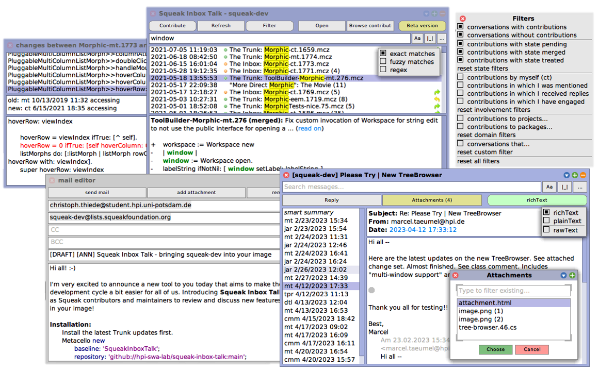

# Squeak Inbox Talk

[](https://github.com/hpi-swa-lab/squeak-inbox-talk/actions/workflows/tests.yml)
[](https://coveralls.io/github/hpi-swa-lab/squeak-inbox-talk)
[](https://github.com/hpi-swa-lab/squeak-inbox-talk/search?type=code&l=Smalltalk&q=%22flag%3A+%22)
[](https://github.com/hpi-swa-lab/squeak-inbox-talk/actions/workflows/release.yml)

> Bringing squeak-dev into your image

A project conducted in the course of the Live Programming Seminar 2021 @ HPI.
Many thanks to [Marcel Taeumel](https://github.com/marceltaeumel) for his diligent mentoring and advice!



## Installation

1. Install the latest Trunk updates for [Squeak](https://squeak.org).

2. Open a workspace and evaluate the following:
   ```smalltalk
   Metacello new
   	baseline: 'SqueakInboxTalk';
   	repository: 'github://hpi-swa-lab/squeak-inbox-talk:main';
   	load.
   ```

3. After the installation, choose "Squeak Inbox Talk" from the Apps menu in the main docking bar and click the Refresh button.

Alternatively, you can download the one-click image from the [latest release](https://github.com/hpi-swa-lab/squeak-inbox-talk/releases) and run it with zero installation effort.

## Why?

Many Squeakers have experienced the following troubles in the past:

1. Tedious navigation on the list: Where has this patch gone? Can someone remember where we were discussing this funky thing recently?
2. High entry barrier for new contributors: You need to sign up on the mailing list to follow discussions.
3. Hard review process: Notifications and discussions appear in your email client, but if you want to check out some code, you will switch to your image, of course.

Squeak Inbox Talk attempts to solve all these issues by merging all relevant artifacts in Squeak, including emails and [Monticello](https://wiki.squeak.org/squeak/1287) contributions, allowing developers to explore them interactively.
It comes with a free-text search and several powerful filters for aspects such as packages, review state of a contribution, and your personal involvement.
These filters should make it easier to survey certain domains, gain a better understanding of the connection between inbox versions, or keep track of your own proposals.

## How does it work?

Basically, Squeak Inbox Talk is implemented by reusing and assembling together the following existing solutions: [Squeak History](https://github.com/hpi-swa/squeak-history), a project originally developed by Marcel (mt) that scrapes and processes all mailing list conversations from the [pipermail archives](http://lists.squeakfoundation.org/pipermail/squeak-dev/); the `SMTPClient` in Squeak for sending messages; and the Monticello infrastructure, which remains the heart of our development workflow. Optionally, further components such as [`IMAPClient`](https://github.com/hpi-swa-teaching/IMAPClient) might follow later. On top of this, Squeak Inbox Talk adds a convenient layer for exploring and filtering conversations and contributions.

## Implementational notes

- This project uses [smalltalkCI](https://github.com/hpi-swa/smalltalkCI).
- [`UPSTREAM.md`](./UPSTREAM.md) contains a list of contributions that were made to upstream dependencies of this repository in the context of this project.

## Further reading

- [Official announcement thread on the squeak-dev mailing list](http://forum.world.st/ANN-Squeak-Inbox-Talk-bringing-squeak-dev-into-your-image-td5130575.html) ([mirror on lists.squeakfoundation.org](http://lists.squeakfoundation.org/pipermail/squeak-dev/2021-July/216008.html))
- [Andrew Black, Stéphane Ducasse, Oscar Nierstrasz, Damien Pollet, Damien Cassou, Marcus Denker, Christoph Thiede, and Patrick Rein. *Squeak by Example. 5.3 Edition.* 2020.](https://github.com/hpi-swa-lab/SqueakByExample-english/releases/tag/5.3)
